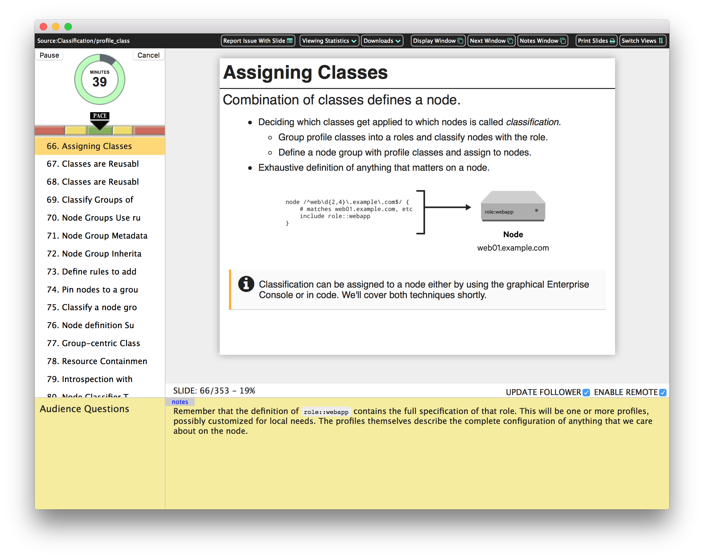

# Showoff Presenter

Showoff is a slideshow presentation tool with a twist. It runs as a web application,
with audience interactivity features. This means that your audience can follow along
in their own browsers, can download supplemental materials, can participate in quizzes
or polls, post questions for the presenter, etc. By default, their slideshows will
synchronize with the presenter, but they can switch to self-navigation mode.

Showoff allows you to author your presentation slides in Markdown, then organize
them with a `showoff.json` file. This file also contains metadata about
the presentation, such as the title, any password protection, etc.

Then you just run `showoff serve` in the presentation directory and open
a browser window.

## Functionality

Beyond the standard presentation functionality, Showoff provides:

* Live presenter tools:
  * presenter view that display notes, tree representation of presentation, and other tools
  * execute code in many languages (Javascript, Ruby, Python, Puppet, etc) live and display results
  * show a pre-show slideshow while you wait to start
  * let audience members download slides, code samples or other supplementary material
  * show a countdown timer to help keep you on pace.
  * show synchronized, hidden notes on another browser (like an iphone)

* Live audience tools:
  * audience can pull up the presentation on their own browsers
  * presentation is synchronized to track the presenter's
  * call up a menu of sections/slides at any time to navigate directly to slides
  * independent navigation so that audience members can go back or catch up as you talk
  * allow the audience to provide pace feedback and ask questions of the presenter
  * allow the audience to provide content feedback on the material

* Content creation and distribution functionality:
  * generate supplemental material based on slide tags
  * generate printed versions of the presentation including handout notes
  * password protect any URL path to keep control over different views of content
  * automatically generate a Table of Contents
  * provide buttons for one-click issue reporting for presentation materials
  * open the current slide in a Markdown editor
  * open the current slide in an online editor such as Github's repository editor
  * track how much time audience members spend on specific slides
  * generate a static form of the presentation and upload it to Github Pages
  * generate a Heroku app to serve your presentation from
  * automatically generate presentations from an outline

Due to it being plain text, you can easily version control it, you can easily move
sections between presentations, and you can rearrange or remove sections easily.

## Installation

Showoff is distributed as a RubyGem. Simply install it like any other gem. Showoff
will run out of the box on OS X and most Linux distributions. To install on Windows,
you'll need to install both Ruby and the Ruby DevKit for compiling native extensions.

    gem install showoff

## Documentation

Please see the user manual on the [Showoff homepage](http://puppetlabs.github.io/showoff)
for further information.

You can also generate a nice & pretty local copy of the user manual by running
`rake doc` in your clone of the repository. The generated HTML will be saved in
the `docs` directory.

## Contributing

See the [CONTRIB.md](CONTRIB.md) file for how to contribute to this project
