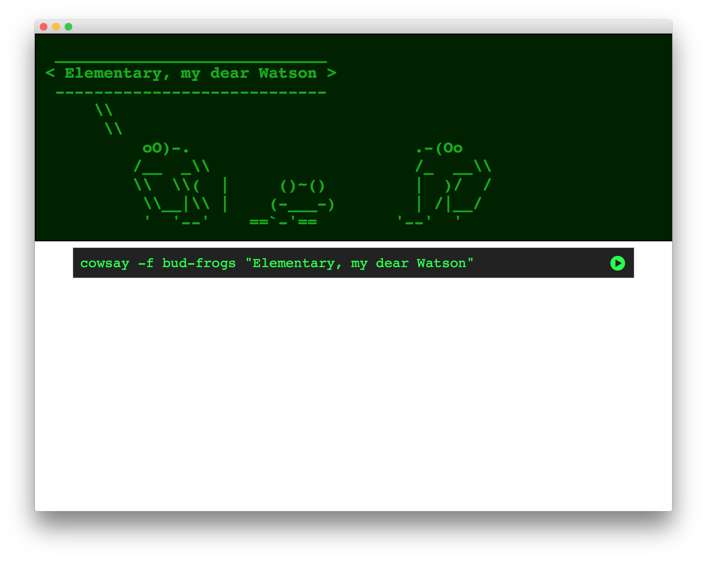

## {{ page.headline }}

If you mark a code block with the `execute` keyword, then it will have a small
*play* icon on the lower right. When the indicator is pressed Showoff can run the
code live and display the results in a slide-down console window over your slides.
If you are using the Presenter window, the output will be displayed on the
Display window.

### Writing code samples

This code sample will invoke Puppet on the machine running the Showoff presentation
to demonstrate the management of a package resource:

    @@@ Puppet execute
    package { 'cowsay':
        ensure   => present,
        provider => gem,
    }

Now that we've got the gem installed, this code sample will enable the viewer to
run it as a specified shell command:
 
    @@@ Shell execute
    cowsay -f bud-frogs "Elementary, my dear Watson"

There are built in handlers for many languages and tickets or pull requests for more
handlers are always welcome.

| Executed in the web browser | Executed on the Showoff server |
|-----------------------------|--------------------------------|
| Coffeescript                | Perl                           |
| Javascript                  | Puppet                         |
|                             | Python                         |
|                             | Ruby                           |
|                             | Shell                          |

Note that anyone viewing the slides has ability to trigger the execution, so
ensure that your demo won't fail if an audience member presses the button!

### Security

You've been reading this right. Your presentation can embed code that will run
**directly on the host computer**, using whatever privileges that the user running
Showoff has.  This has the potential for some nasty security holes, so we've
mitigated them in a few ways. First, no code is actually transmitted over the
wire. The code to be run has to actually exist inside the slide file on disk for
Showoff to run it.  Second, you must start Showoff with a flag enabling code
execution.

    $ showoff serve --help
    ...
        -x, --[no-]executecode      - Enable remote code execution
    $ showoff serve -x
