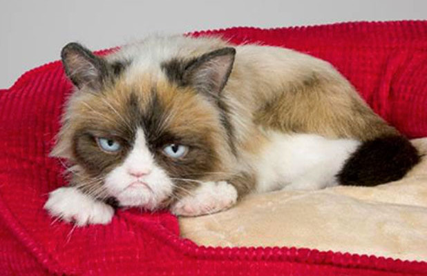

<!SLIDE[bg=assets/yellow-brick-road.jpg] one>
# One

This little piggy stayed home.

<!SLIDE two piggy>
# Two

This little piggy had roast beef.

<!SLIDE[transition=fade] three>
# Three

This little piggy had none.

<!SLIDE supplemental guide>
# The Guidebook

So here's how this works...
